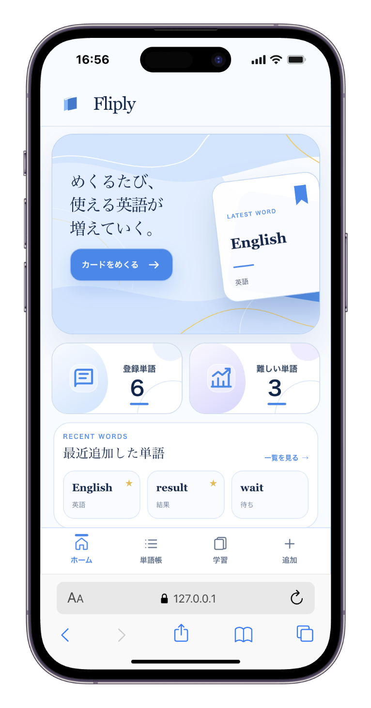
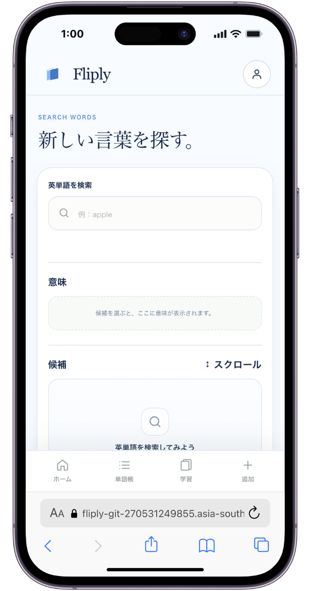
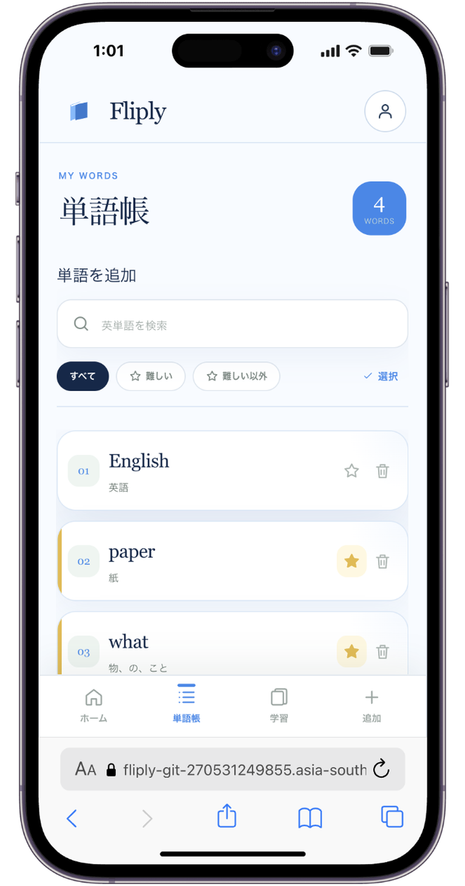
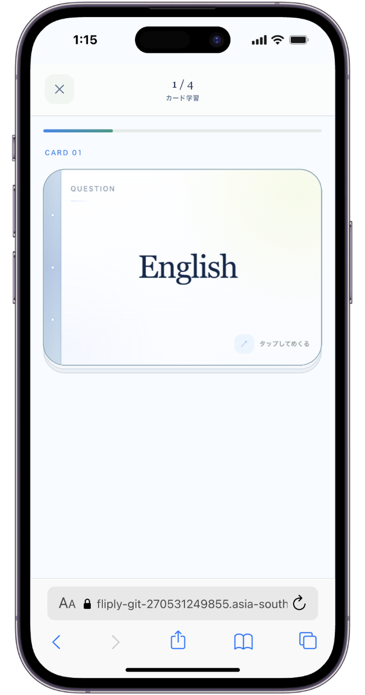

# Fliply

英単語学習アプリです。  
辞書から単語を探して登録し、フラッシュカードで「めくりながら」定着させられます。

**公開URL:** [https://fliply-git-270531249855.asia-southeast1.run.app/](https://fliply-git-270531249855.asia-southeast1.run.app/)

---

## アプリケーション概要

KADOKAWAドワンゴ情報工科学院・審査会にて制作を進めました。

Fliply は、覚えたい英単語を自分で選び、カード学習で繰り返し復習できる Web アプリです。

単語の選定から復習までを一つの流れにつなぎ、使える英語を少しずつ増やしていけるように制作しました。

---

## サービスへの想い

単語帳に登録したはずなのに、いざ使う場面で出てこない。  
意味は覚えたつもりでも、繰り返し触れないとすぐに薄れてしまう。  
そんな経験は、英語学習のなかでよくあることだと思います。

一方で、最初から大量の単語を覚えようとしても続きにくいものです。  
自分が今必要としている語、気になった語から始めるほうが、学習は続きやすく、記憶にも残りやすいと考えました。

そこで Fliply では、まず辞書から単語を探し、意味を確認して自分の単語帳へ入れるところを入り口にしました。  
そのうえで、カードをめくりながら繰り返し触れることで、単語を「知っている」から「使える」へ近づけていく。

めくるたびに、使える英語が増えていく。  
私たちは、そのような学習体験を目指して制作を進めました。

---

## チームメンバー


| 名前  | 担当 | GitHub |
| --- | --- | --- |
| 伊藤秀 | フロントエンドエンジニア<br>デザイナー | [https://github.com/shuito124](https://github.com/shuito124) |
| 高橋仁 | バックエンドエンジニア | [https://github.com/jin-takahashi09](https://github.com/jin-takahashi09) |


---

## 主な機能


| 機能      | 内容                                                            |
| ------- | ------------------------------------------------------------- |
| ホーム     | 学習の入口。登録単語数・難しい単語数、最新単語の表示                                    |
| 辞書検索    | 英単語の前方一致候補（ESDB ワードリスト）。意味は Wiktionary 優先、なければ DeepL へフォールバック |
| 単語追加    | 意味候補から選んで単語帳へ登録。登録済みの解除にも対応                                   |
| 単語帳     | 一覧・検索・編集・削除、「難しい」フラグの切り替え                                     |
| カード学習   | 学習設定からセッション開始。カードをめくって復習                                      |
| 意味キャッシュ | 取得済みの意味候補をキャッシュし、同じ語の再取得を高速化                                  |


---

## 技術スタック


| 区分      | 技術                                                                                                                                                                                                                                                                                                                           |
| ------- | ---------------------------------------------------------------------------------------------------------------------------------------------------------------------------------------------------------------------------------------------------------------------------------------------------------------------------- |
| フロントエンド |    |
| バックエンド  |                                                                                                                        |
| データベース  |                                                                                                                                                                                                                        |
| 辞書・翻訳   |                                                                                                                       |
| 開発ツール   |                                                                                                                            |


---

## アプリの画面


| ホーム                                | 辞書検索・追加                                  |
| ---------------------------------- | ---------------------------------------- |
|   |  |
| 単語帳                                | カード学習                                    |
|  |      |


---

## ローカル起動

### 前提

- PHP 8.3+ / Composer
- Node.js / npm
- （任意）DeepL API キー — Wiktionary で訳が取れない語のフォールバック用

### 手順

```bash
git clone https://github.com/jin-takahashi09/fliply.git
cd fliply

composer install
cp .env.example .env
php artisan key:generate

# （任意）DeepL を使う場合
# DEEPL_API_KEY=your_key_here を .env に記入

php artisan migrate
php artisan dictionary:import

npm install
npm run build

composer serve
# または
php artisan serve --port=8001
# http://127.0.0.1:8001
```

### 環境変数のポイント


| ファイル   | 主な項目                                                                                        |
| ------ | ------------------------------------------------------------------------------------------- |
| `.env` | `APP_KEY` / `APP_URL=http://localhost:8001` / `DEEPL_API_KEY`（任意） / `WIKTIONARY_USER_AGENT` |


`DEEPL_API_KEY` 未設定でも、Wiktionary で意味が取れる語は利用できます。

---

## 今後の展望

- カメラで英単語を読み取り、そのまま単語帳へ追加する機能
- 他ユーザーの単語帳を閲覧し、気に入った単語を自分の単語帳へ追加できる機能
- 英単語の発音や例文を確認できる機能
- 学習した単語数や正答率などを確認できる学習記録機能

などが今後の展望です！！！！！！！！！！！！１